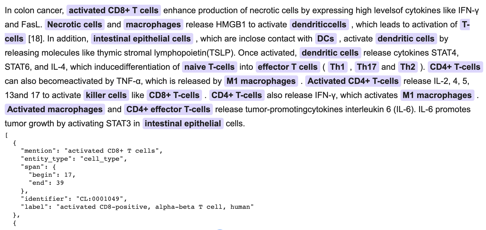

# CellExLink

CellExLink is an end-to-end biomedical text-mining pipeline that detects cell-type mentions and links each mention to a standardized Cell Ontology (`CL`) identifier. It combines a jointly fine-tuned Bioformer16L recognizer with a fine-tuned SapBERT retrieval model, document-level abbreviation handling, and semantic–lexical candidate reranking. CellExLink accepts BioC XML and returns annotated BioC XML while preserving the original document structure and text.



## Input and output

**Input**

- One unannotated [BioC XML](https://bioc.sourceforge.net/) file, or a directory containing BioC XML files at its top level.
- Typical inputs include PubMed titles and abstracts or eligible PMC full-text articles obtained through the NCBI BioC APIs.

**Output**

- One annotated BioC XML file for each input document.
- Each detected cell-type mention is returned with its text span, character offset and length, predicted `cell_type` label, Cell Ontology identifier, and matched Cell Ontology name.
- The original passages and document structure are retained. For directory input, output files are named `<input-stem>.normalized.xml` by default.

```text
BioC XML
   ↓
Bioformer16L cell-type recognition
   ↓
SapBERT retrieval + abbreviation handling + candidate reranking
   ↓
BioC XML with cell-type spans and CL identifiers
```

## How CellExLink works

1. **Named entity recognition (NER):** Bioformer16L detects cell-type mention spans in biomedical text.
2. **Named entity normalization (NEN):** Fine-tuned SapBERT retrieves candidate Cell Ontology concepts from preferred labels and synonyms. Abbreviation handling and semantic–lexical reranking select the final `CL` identifier.

The released command-line workflow runs both stages automatically; users do not need to fine-tune the models or manually transfer NER output into the normalization component.

## Installation

```bash
git clone https://github.com/ShahriyariLab/CellExLink-End-to-End-Cell-Type-Extraction-and-Cell-Ontology-Normalization-from-Biomedical-Text.git CellExLink
cd CellExLink

conda create -n cellexlink python=3.12 -y
conda activate cellexlink
python -m pip install -r requirements.txt
```

## Download the released models

The default recognition and ontology-linking checkpoints are hosted on Hugging Face and are not stored in this repository:

- Recognition: [`CellExLink-bioformer16L`](https://huggingface.co/almire/CellExLink-bioformer16L)
- Ontology linking: [`CellExLink-Sapbert`](https://huggingface.co/almire/CellExLink-Sapbert)

Download both checkpoints with:

```bash
python -m pip install huggingface_hub
python download_models.py
```

This creates:

```text
models/
  CellExLink-bioformer16L/
  CellExLink-Sapbert/
  models.json
```

## Run CellExLink

### Single BioC XML file

```bash
python prediction_script.py \
    examples/input_bioc.xml \
    --output-path examples/input_bioc_normalized.xml
```

A precomputed output is available at:

```text
examples/input_bioc_normalized.xml
```

### Directory of PubMed abstracts

```bash
python prediction_script.py \
    examples/bioc_abstracts \
    --output-root examples/bioc_abstracts_annotated
```

### Directory of PMC full-text articles

```bash
python prediction_script.py \
    examples/bioc_fulltext \
    --output-root examples/bioc_fulltext_annotated
```

Precomputed outputs are available in:

```text
examples/bioc_abstracts_annotated/
examples/bioc_fulltext_annotated/
```

## Example input and output

**Input passage**

```xml
<passage>
  <infon key="type">title</infon>
  <offset>0</offset>
  <text>B lymphocytes: how they develop and function.</text>
</passage>
```

**Output annotation added by CellExLink**

```xml
<annotation id="T1">
  <infon key="type">cell_type</infon>
  <infon key="CellExLink-Sapbert_id_0">CL:0000236</infon>
  <infon key="CellExLink-Sapbert_identifier_name_0">B lymphocyte</infon>
  <location offset="0" length="13"/>
  <text>B lymphocytes</text>
</annotation>
```

## Training and evaluation

Developer documentation is available for reproducing model fine-tuning and benchmark evaluation:

- [Training and benchmark evaluation](TRAINING_EVALUATION.md)
- [Baseline methods](other_baselines/README.md)

### Joint NER fine-tuning

With `--train-xml dataset`, the released NER training pipeline:

1. selects the designated `train.xml` file from each corpus directory under `dataset/`;
2. excludes annotations whose type is `cell_vague` during training-data conversion;
3. maps CellLink labels `cell_phenotype` and `cell_hetero` to the shared `cell_type` label; and
4. writes the resulting passage records sequentially into one JSONL training set.

This is **record-level concatenation**. The raw XML files are not concatenated, and removing a `cell_vague` annotation does not remove its entire passage; any remaining annotations and passage text are retained.

## Data

The CellLink, BioID, CRAFT, AnatEM, and JNLPBA resources used by this project are available from the associated Zenodo record:

<https://doi.org/10.5281/zenodo.18090009>

Please follow each dataset's license, citation, and redistribution terms.

## License

Unless otherwise noted, CellExLink source code is licensed under the Apache License, Version 2.0. See [LICENSE](LICENSE).

Datasets, ontology resources, and dependencies remain subject to their respective licenses and terms of use.

## Citation

When using CellExLink, please cite the versioned software release and the associated paper. Citation metadata are provided in [CITATION.cff](CITATION.cff).

## Questions and issues

For usage questions or bug reports, open a GitHub issue and include:

- the command or script you ran;
- the input format;
- the relevant error message; and
- your operating system and Python version.
